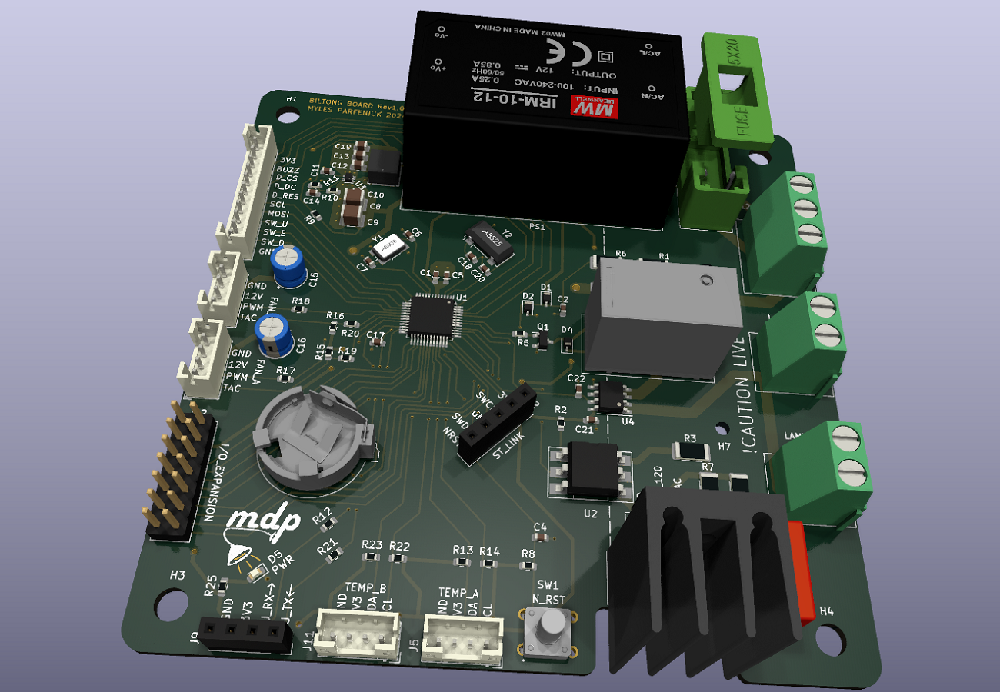
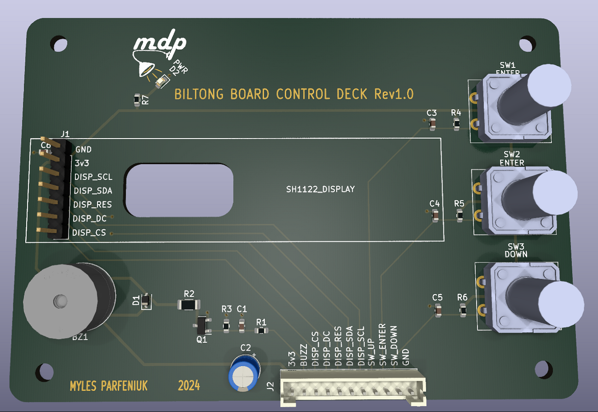
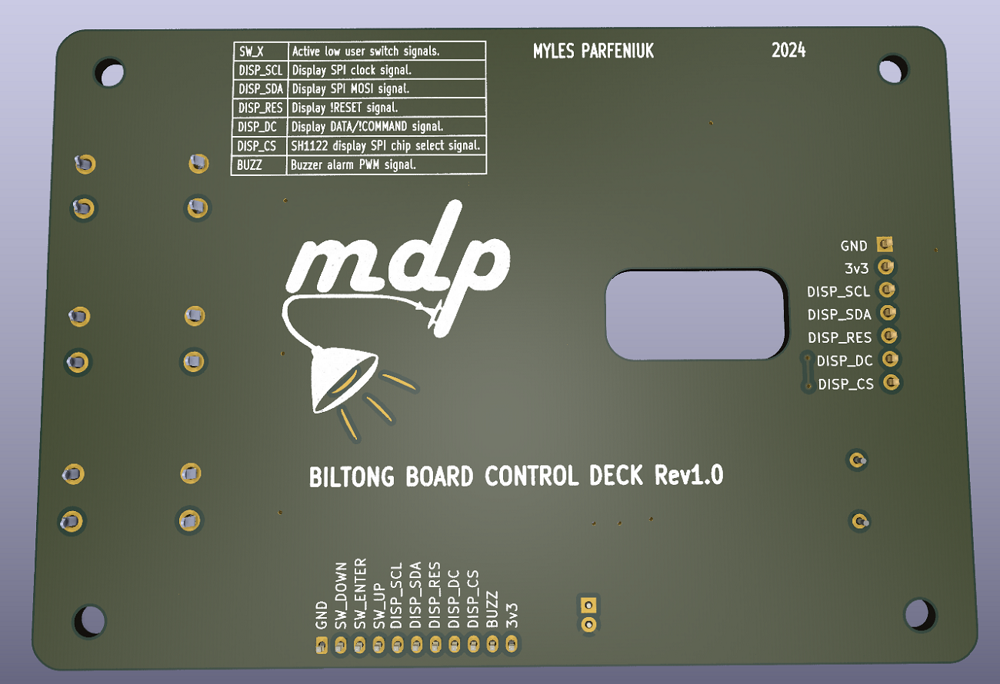

# About
Sun drying emulation controller for biltong and other dried foodstuffs,  based around STM32G030 series controller.  
Intended to be used with drying enclosures like biltong-boxes to produce sun-dried foods in non-ideal climates. 

# Table of Contents

- [About](#about)
- [Hardware](#hardware)
  - [System Block Diagram](#system-block-diagram)
  - [PCB Renders](#pcb-renders)
  - [Layout](#layout)
  - [Schematics](#schematics)
- [Firmware](#firmware)

# Hardware

Biltong board is composed of 4 separate PCBs: a main driver board, a UI/control deck board, and 2 identical temperature + humidity sensor breakout boards.   

The schematics and layout files for all boards can be found within the `hardware` directory of this repo, in the form of KiCad 7.0 projects.

The key features of each board:

Main board:
- Interfaces to drive sensor breakout boards, the control deck board,  heat lamps, and +12V PC fans.
- Stand alone power supply, no DC adapter required. 
- A magnetically isolated current sensor for linearizing the response of the triac based heat-lamp dimmer circuit. 
- A low speed oscillator and coin-cell battery interfaced to STM32's RTC for time keeping during power loss.
- A normally open safety relay to remove the lamps from circuit.
- IO expansion header, with unused GPIO for development of new features or debugging. 
- Extra mounting holes for safety cover, to prevent mishaps with high voltage side of board. 

UI/control deck board: 
- An SPI based SH1122 driven OLED display for indicating information to the user.
- 3 navigation buttons for user input.
- A buzzer to notify user attention is required. 

Sensor Breakout Board: 
- I2C based [temperature and humidity sensor](https://www.we-online.com/en/components/products/WSEN-HIDS) from Würth Elektronik for closing loop between fans and lamps.

## System Block Diagram

| SIGNAL       | PIN # | GPIO# | PERIPHERAL                       | DESCRIPTION                                                                                 |
|--------------|-------|-------|----------------------------------|---------------------------------------------------------------------------------------------|
| DISP_SCL     | 12    | PA1   | SPI1                             | SH1122 display SPI clock signal.                                                            |
| I2C1_SDA     | 32    | PA10  | I2C1                             | Temp & humidity sensor  A I2C data signal.                                                  |
| I2C2_SCL     | 33    | PA11  | I2C2                             | Temp & humidity sensor A I2C clock signal.                                                  |
| I2C2_SDA     | 34    | PA12  | I2C2                             | Temp & humidity sensor  B I2C data signal.                                                  |
| DISP_MOSI    | 13    | PA2   | SPI1                             | SH1122 display SPI data signal.                                                             |
| SW_UP        | 14    | PA3   | GPIO                             | Active low user up navigation button signal.                                                           |
| SW_ENTER     | 15    | PA4   | GPIO                             | Active low user enter/select navigation button signal.                                                 |
| SW_DOWN      | 16    | PA5   | GPIO                             | Active low user down navigation button signal.                                                         |
| FAN_B_PWM    | 17    | PA6   | TIM16_CH1 or TIM3_CH1            | Fan B PWM signal.                                                                           |
| FAN_B_TACH   | 18    | PA7   | GPIO or  TIM17_CH1 or  TIM14_CH1 | Fan B tachometer signal.                                                                    |
| I2C1_SCL     | 29    | PA9   | I2C1                             | Temp & humidity sensor B I2C clock signal.                                                  |
| FAN_A_TACH   | 19    | PB0   | GPIO or  TIM3_CH3                | Fan A tachometer signal.                                                                    |
| FAN_A_PWM    | 20    | PB1   | TIM14_CH1                        | Fan A PWM signal.                                                                           |
| UART_TX      | 22    | PB10  | USART3                           | Serial console UART TX signal for development.                                              |
| UART_RX      | 23    | PB11  | USART3                           | Serial console UART RX signal  for development.                                             |
| I_SENSE      | 24    | PB12  | ADC_IN16                         | Heat lamp current sensor output, analog signal from 0 -> vcc/2 (0A) ->vcc.                  |
| ZERO_CROSS   | 44    | PB5   | GPIO                             | Live/mains signal for sine wave zero cross detection (triac shut off point).                |
| BUZZ         | 45    | PB6   | GPIO or TIM1_CH3 or  TIM16_CH1N  | Buzzer alarm signal, frequency modulated PWM.                                               |
| DISP_CS      | 46    | PB7   | GPIO                             | SH1122 display SPI chip select signal.                                                      |
| DISP_DC      | 47    | PB8   | GPIO                             | SH1122 display data/!command signal, held low for data, high for commands.                  |
| DISP_RES     | 48    | PB9   | GPIO                             | SH1122 display reset signal.                                                                |
| TRIAC_TRIG   | 42    | PB3   | GPIO                             | Triac dimmer trigger, single pulse enables triac until instantaneous AC voltage crosses 0V. |
| HEAT_LAMP_EN | 43    | PB4   | GPIO                             | Normally open heat lamp saftey relay enable. When held high heat lamp circuit is closed.    |

(<a href="#readme-top">back to top</a>)

## PCB Renders

### Main Board
 
 

### Control Deck Board
 
 

### Sensor Breakout Board
See [myles-parfeniuk/wsen_hids_breakout](https://github.com/myles-parfeniuk/wsen_hids_breakout).

(<a href="#readme-top">back to top</a>)

## Layout

### Main Board

### Control Deck Board

### Sensor Breakout Board
See [myles-parfeniuk/wsen_hids_breakout](https://github.com/myles-parfeniuk/wsen_hids_breakout).

(<a href="#readme-top">back to top</a>)

## Schematics

### Main Board

### Control Deck Board

### Sensor Breakout Board
See [myles-parfeniuk/wsen_hids_breakout](https://github.com/myles-parfeniuk/wsen_hids_breakout).

(<a href="#readme-top">back to top</a>)

# Firmware

The firmware is currently being developed. This repo will updated as work is completed.

(<a href="#readme-top">back to top</a>)
